# Finding Loyalty

Did you know it costs a business about 5-25X more to acquire a new customer than it does to sell to an existing one? Not only that, but existing customers spend 67% more than new customers. In short, customer loyalty really pays off -- and customer loyalty programs end up paying for themselves.

## Problem Statement
---
Companies need to understand the customers’ data better in all aspects. Detecting similarities and differences among customers,
predicting their behaviors, proposing better options and opportunities to customers became very important for customer-company engagement. Segmenting the customers according to their data became vital in this context. RFM (recency, frequency and monetary) values have been used for many years to identify which customers valuable for the company, which customers need promotional activities, etc.

## Machine Learning Process
---

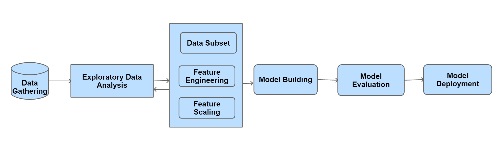

##  Data Gathering
---
I have used data of Olist, an e-commerce site of Brazil.

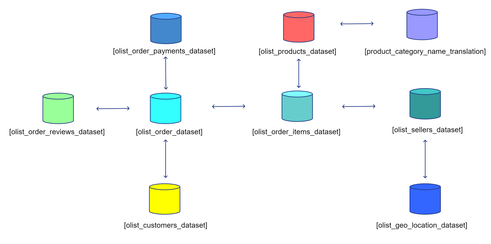

I got the data in 9 different csv. Then I loaded them in SQL Server. Where I have done my initial cleaning, removed null values, joined them together and prepare a final dataset to explore more.

##  Exploratory Data Analysis
---

While exploring the data my focus as mainly in 

1. Revenue
2. Product
3. Review

**Revenue**

80% revenue are coming from big cities.

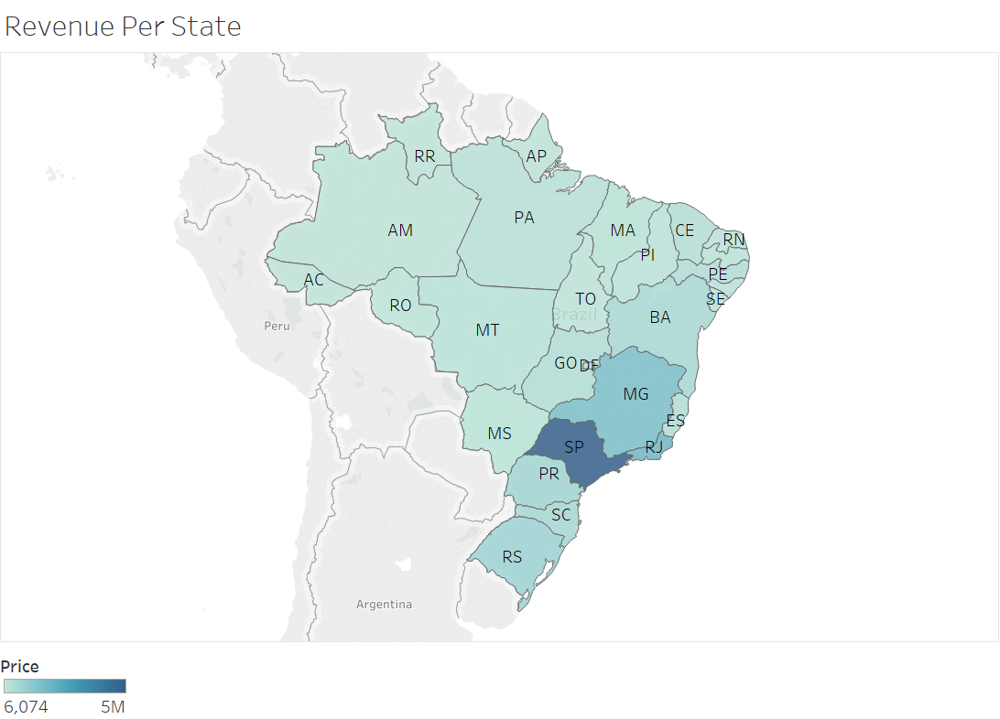

But interestingly average freight values are higher in remote states.

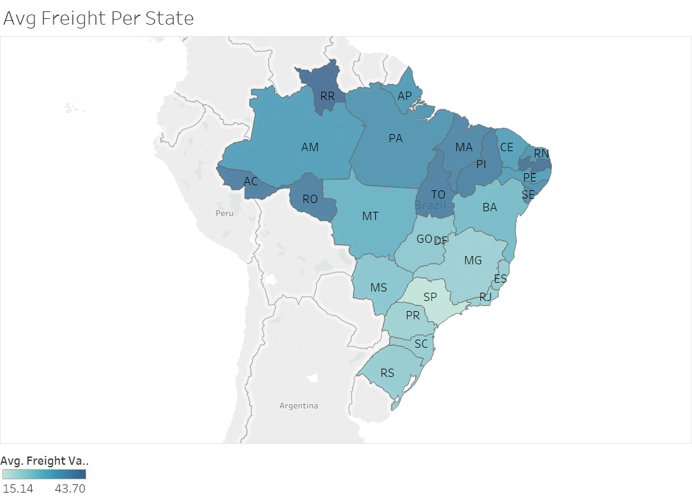

This also affect the reviews in those areas.

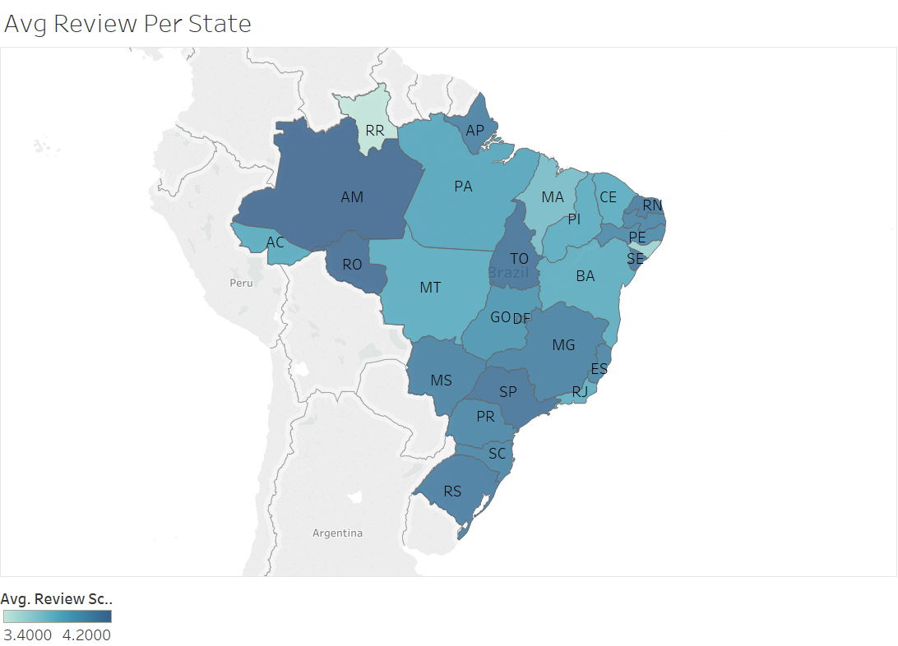

There are products which people tends to buy again and again.

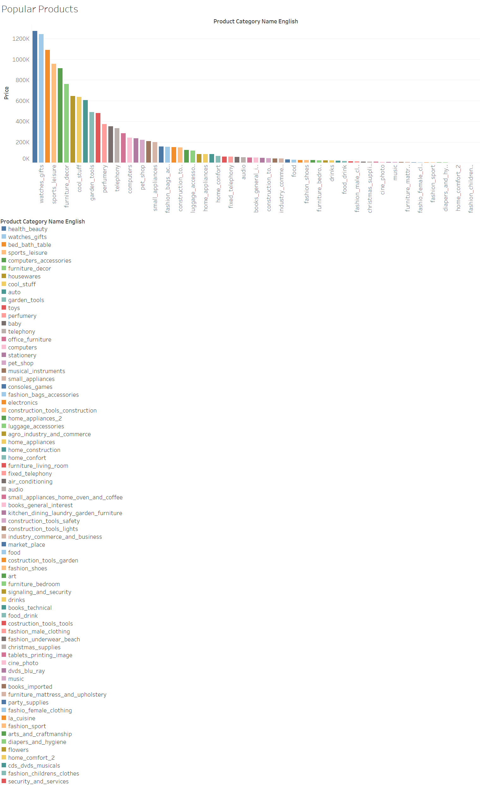

## RFM Analysis
---
RFM analysis is a customer segmentation technique that uses past purchase behavior to segment customers.

    Recency (R) - Time since last purchase 
    Frequency (F) - Total number of purchases 
    Monetary value (M) - Total monetary value 

I then performed RFM analysis to the whole dataset.

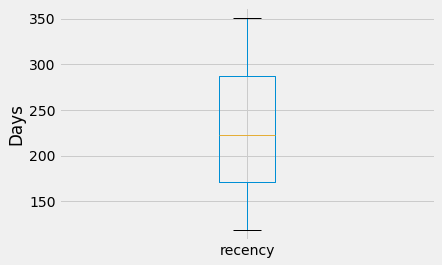

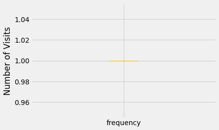

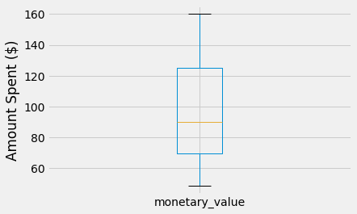

Based on their data I have labelled them as follows:    

    Best Customers: 111
    Loyal Customers: X1X
    Big Spenders: XX1
    Almost Lost: 311
    Lost Customers: 411
    Lost Cheap Customers: 444
    
Approximately 70% are regular customer:

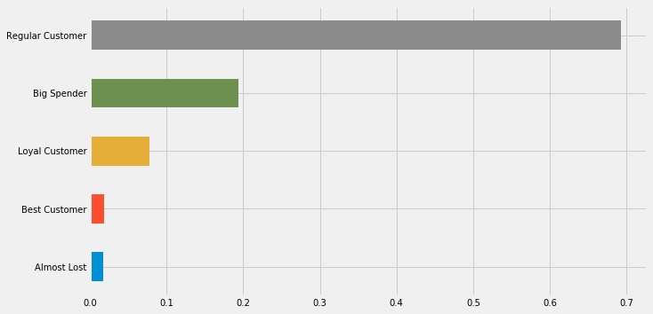

## Model Building

As I have a labelled data now, I have tried Logistic Regression, Naibe Bayes and Random Forest Classifier to predict customer loyalty.

### Logistic Regression

                   precision recall  f1-score  support

    Almost Lost    0.32      0.05    0.08      1160
    Best Customer  0.49      0.03    0.06      1194
    Big Spender    0.78      0.60    0.68      5241
    Loyal Customer 0.44      0.16    0.23      4066
    Regular        0.71      0.96    0.81     16482

    avg / total    0.66      0.70    0.64     28143

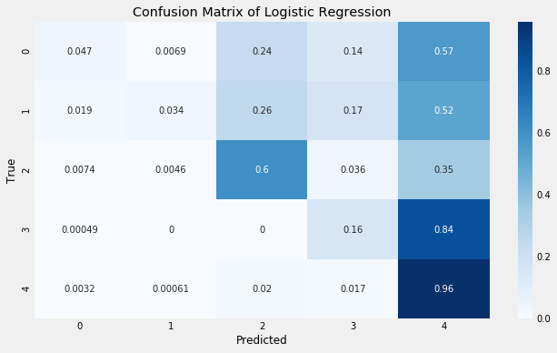

### Naive Bayes

                       precision recall    f1-score  support

     Almost Lost       0.24      0.01      0.02      1160
     Best Customer     0.47      0.01      0.01      1194
     Big Spender       0.52      0.09      0.15      5241
     Loyal Customer    0.34      0.04      0.07      4066
     Regular           0.60      0.97      0.74     16482

     avg / total       0.53      0.59      0.48     28143

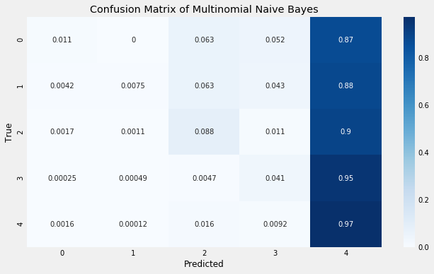

### Random Forest Classifier

                       precision recall    f1-score  support

     Almost Lost       0.89      0.60      0.71      1160
     Best Customer     0.89      0.59      0.71      1194
     Big Spender       0.91      0.93      0.92      5241
     Loyal Customer    0.94      0.81      0.87      4066
     Regular           0.91      0.98      0.94     16482

     avg / total       0.91      0.91      0.91     28143

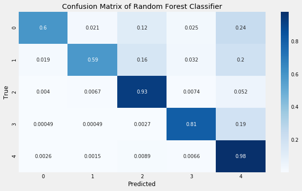

## Model Evaluation
---

Based on their performance I have selected Random Forest Classifier as my final model which is giving me more 90% accuracy rate.

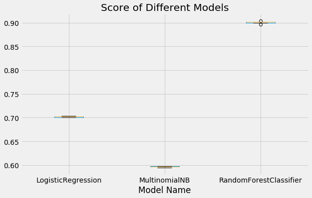

## Deployment
---
After getting the model I have deployed my model using a flask application in heroku.

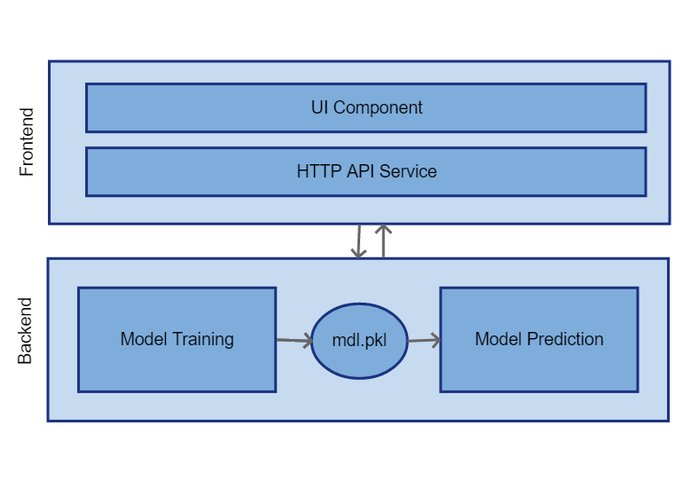

User can select criteria of a customer and this [application](https://find-customer-loyalty.herokuapp.com/#) will tell whether this customer will be loyal or not in future.

## Source Code
---
Source code can be found on [Github](https://github.com/ikfaisal/find-loyal-customer.git). I look forward to hear any feedback or questions.
